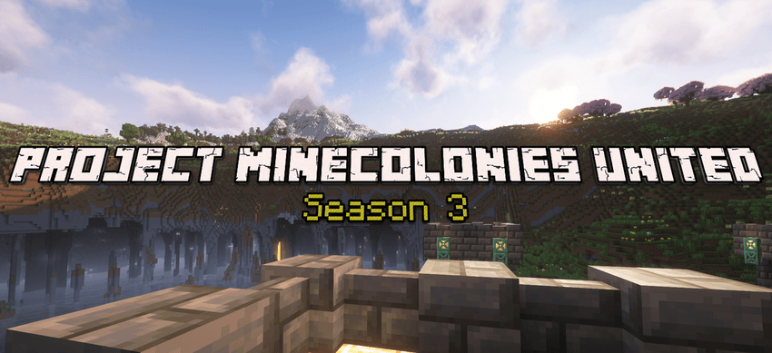

# Project Minecolonies United

## Overview
Welcome to a world of **Vanilla++ fun**! This modpack centers around building and managing your own colony with **Minecolonies**, enhanced by a brand-new **Quest system** that provides goals, guidance, and exciting challenges to keep you engaged from start to finish. Whether you play solo or team up with friends, Vanilla++ offers a rewarding adventure where you’ll hone your skills and carve out your place in the world.

## Features
- **Minecolonies**: The core experience, letting you build and manage your own thriving colony.
- **Quests**: A newly added system with goals and challenges to guide your journey.
- **Sophisticated Storage**: Advanced storage solutions for your colony.
- **Tom’s Storage**: Additional storage options for ease of use.
- **Refined Storage**: Custom-tuned for the Vanilla++ theme.
- **The Aether**: Explore a mystical dimension.
- **Aquaculture**: Dive into enhanced fishing mechanics.
- **Armor of the Ages**: Equip unique and powerful armor sets.
- ... and many more mods waiting to be discovered!

## Installation
To set up the PMU modpack:

1. **Download the modpack**:
   - Use a [CurseForge](https://www.curseforge.com/download/app) modpack launcher.
   - Download [PMU](https://www.curseforge.com/minecraft/modpacks/project-minecolonies-united) from CurseForge website or the launcher itself.
2. **Launch the game**:
   - To get whitelisted on our official server - join our Discord server below. If you intend to play on your own server, we have a server pack available to download using CurseForge.

## Usage
This modpack is designed for both singleplayer and multiplayer, but shines brightest on a server with friends. For the best experience, join our official lag-free server to interact with our kind and helpful community.

## Community
Join our vibrant community on Discord to connect with other players, share tips, and get support:

|You can also find us on Discord for help or just to chat as well as Reddit|
||

This modpack is primarily designed for multiplayer to enhance interaction with others. While singleplayer is supported, the full experience comes alive on our server.
# Please share suggestions or bug reports via Discord or GitHub issues. 

> **Note**: Our edited config files are free to use in other modpacks with proper respect to original mod authors. KubeJS scripts are allowed for use only with proper credits to our modpack (including link to our modpack on CurseForge and version of PMU that was code copied from).